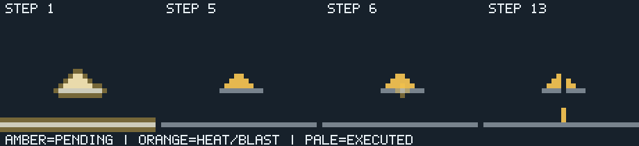
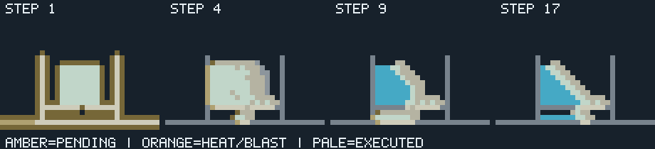
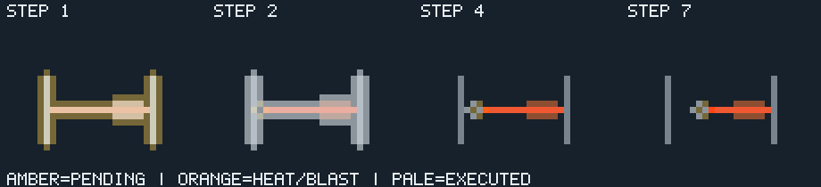
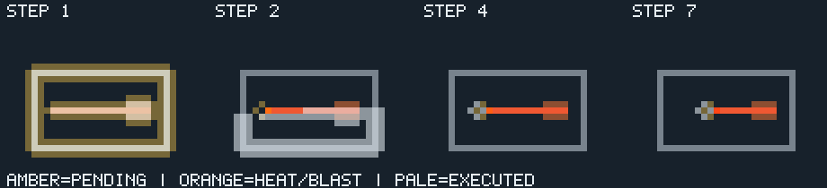
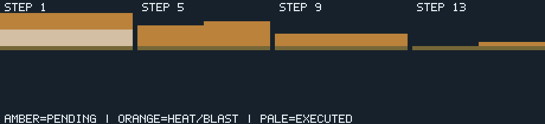
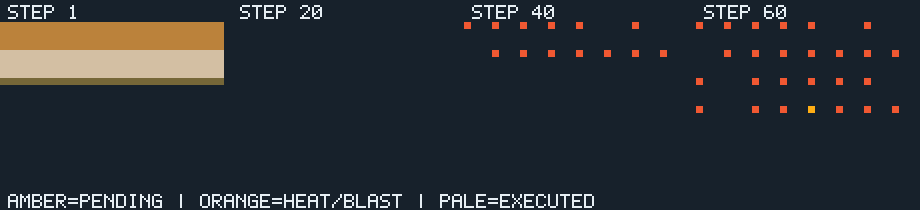

# Simulation rules

## World and boundaries

The row-major world has a closed boundary. Out-of-range neighbors do not exist. Cell IDs are zero-based validated indices. Rule order and neighbor order are stable: up, left, right, down. Local updates are asynchronous scheduler quanta, not global ticks. A dormant cell receives no recurring evaluation; movement, ignition, blasts, and accepted edits wake a fixed cardinal neighborhood.

Materials are Air, Stone, Wood, Sand, Explosive, and Water. Stone is fixed until changed by an explicit edit. Burning is a cell-state countdown on wood, not an additional material. Cell reads preserve the existing `state` byte for pending blast energy and add `burning` as an additive state field.

<link rel="stylesheet" href="rules-images/rules.css">

**Illustration palette:** Air `#17212b`, stone `#78838d`, wood `#8d4e31`, sand `#e5b84f`, explosive `#f05832`, water `#45a9c5`. Strip overlays: amber marks pending work, orange marks heat or blast energy, and pale highlights mark cells executed in the latest slice. Each panel prints its simulation step; all panels come from the real simulation.

## Granular and water movement

Sand and water inspect the cell directly below. If it is Air, the material moves there atomically. Sand otherwise remains dormant. Water otherwise tries one horizontal neighbor; initial direction is selected by `(x + y) mod 2`, and it tries the opposite direction if blocked. The closed boundary prevents escape. This intentionally simple local spreading rule may oscillate and is not a pressure-fluid model.

A successful move clears the source, fills the destination, and wakes cardinal neighbors of both cells. Sand and water counts are conserved by simulation movement. Explicit paint/reset can change counts. Each evaluation inspects a fixed bounded neighborhood, and no rule searches an unbounded column or region.

<figure class="rule-strip-figure">
  
  <figcaption>Steps 1, 5, 6, and 13: sand stacks on a temporary stone shelf; painting one support cell to air opens a notch, and later service moves grains down.</figcaption>
</figure>

<figure class="rule-strip-figure">
  
  <figcaption>Each frame follows another fixed group of simulation slices: water falls through the one-cell floor opening, then spreads through the lower chamber where a neighbor is available.</figcaption>
</figure>

## Fire and explosives

Wood ignition sets a 12-service burn countdown. On each serviced burning-wood evaluation, its cardinal neighbors are inspected: adjacent wood is ignited and adjacent explosives receive a blast request with energy 8. The current wood countdown decreases by one; at zero, wood converts to Air. The cell remains wood while burning. Evaluation is rescheduled only while burn time remains. Ignition is idempotent while already burning.

A blast request changes its target to Explosive and merges energy by `max(existing, min(requested, 15))`, not addition. A serviced blast converts the explosive cell to Air. Each cardinal adjacent explosive receives `max(existing, energy - 1)` when energy exceeds one. Adjacent wood is ignited by the blast regardless of remaining propagation energy. Blast energy is finite, saturating, and attenuates by one edge; this is not an additive physical shock wave. Stone, sand, and water are not destroyed by blast in this rules version.

<figure class="rule-strip-figure">
  
  <figcaption>From an unlit 12-by-6 wood patch through three increasing service intervals: orange heat spreads to adjacent wood while burning cells remain wood during their countdown.</figcaption>
</figure>

<figure class="rule-strip-figure">
  
  <figcaption>Successive fixed slice groups show an end cell ignited, serviced into air, and energy advancing along the explosive row before reaching adjacent wood.</figcaption>
</figure>

<figure class="rule-strip-figure">
  
  <figcaption>Energy 8 is triggered at the left end of the explosive chain. Each serviced edge loses one energy; neighboring wood ignites, while stone contains the scene and remains unchanged.</figcaption>
</figure>

Fire, blast, and edit activity wake only fixed cardinal neighborhoods. All timers advance on service, not wall time. Under overload, different regions progress at different rates; this is not uniform time dilation.

## Coalescing and reset

Duplicate reevaluation requests coalesce to one per-cell pending bit. Blast requests coalesce by maximum energy. Pending state remains authoritative when a ready ring is full and is admitted by the charged recovery cursor. Paint commands to the same cell coalesce to the latest material by a direct per-cell queue-slot index in O(1); a full command ring rejects a new distinct command. The command ring is capped at 256 descriptors. Fixture preparation blocks external mutations until its charged cursor completes or is cancelled.

Reset increments a checked world generation immediately, discards queued command/job frontiers, and blocks new edits while a cursor clears one cell per charged reset quantum. Every old job is generation-tagged and cannot mutate the new generation. Reset progress is observable; cancellation is deliberately not offered for world reset. Starting a fixture schedules reset and then a versioned fixture cursor, both advanced only by `World::step`; fixture progress and cancellation are observable. Reset marks renderer chunks dirty as cells are cleared.

<figure class="rule-strip-figure">
  
  <figcaption>After settling, a cell on the stone ledge is explicitly marked for evaluation. The following three slices service only admitted local work; the sand stays dormant unless newly woken.</figcaption>
</figure>

<figure class="rule-strip-figure">
  
  <figcaption>After reset begins, each 100-credit slice clears only a bounded prefix of cells. The frames show successive partial progress, not one instantaneous whole-world clear.</figcaption>
</figure>

<figure class="rule-strip-figure">
  
  <figcaption>Each 160-credit slice first advances reset and then fixture preparation by charged cells; successive frames reveal an expanding deterministic explosive lattice.</figcaption>
</figure>

Regenerate these deterministic, 32 by 24, simulation-derived illustrations with `cargo run --locked -p cascade-rule-shots -- docs/rules-images`. Each strip compares the captured setup state with the state after the fixed number of `World::step` calls in `crates/rule-shots/src/main.rs`; colors and overlays match the interactive tour.
## Player focus and action records

`Command::Paint`, `Command::Ignite`, and `Command::Detonate` are admitted through the bounded command ring. When executed, each action installs a focus rectangle covering the target chunk and its adjacent chunks, with an eight-slice lifetime. `Command::FocusViewport` admits a clipped, exclusive chunk rectangle and explicit slice lifetime. Eight fixed regions are retained; an expired region is reused first, otherwise the region nearest expiry is replaced. Focus membership is the union of active regions. Commands and focus regions participate in the replay hash.

Evaluation and blast work in focused chunks prefers the matching fixed focus ring. If it is full, admission tries the normal FIFO ring; if that is also full, per-cell pending state retains the work for charged recovery. On region activation, the charged recovery cursor promotes already-pending work. A pending channel can have one queued normal and one queued focus reference during promotion; the first execution clears the pending channel and a later duplicate is charged as stale and cannot execute the effect again.

The scheduler's focus share applies only while focus work is ready. The configured background minimum is validated as nonzero and the focus share cannot consume it. Disabling focus restores FIFO treatment, including draining any queued focus references without priority. Traditional mode continues to snapshot and process the full pending frontier under its existing semantics.

Each admitted target action writes a fixed-ring record with its admission slice and the slice its command is applied. First effect is the earliest subsequent executed evaluation or blast rule quantum touching the target cell or one of its eight immediate neighbors; the command quantum that admits/installs the action is not counted as a simulation effect. Local settle is the first slice after first effect where no evaluation or blast channel remains in that 3x3 cell neighborhood. Records are overwritten oldest-first at capacity; action latency is slice-based, not wall-clock simulation time.

The rules version is `RULE_VERSION = 6`. Determinism is guaranteed only for the same executable/rules, world dimensions, admitted operation order, capacities, policy, focus configuration, and slice schedule. Bounded mode spends at most its allowance. Traditional mode snapshots the per-cell pending evaluation and blast channels plus the command count at update start, processes that entire captured frontier without the credit cap, and leaves work created during the update for the next one. It charges and times both full-world scans and never recursively drains to quiescence.
