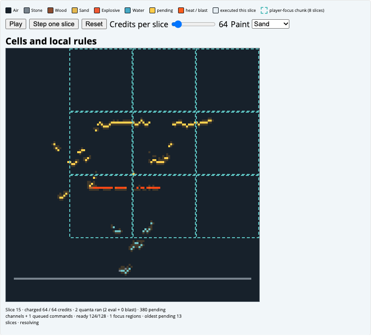
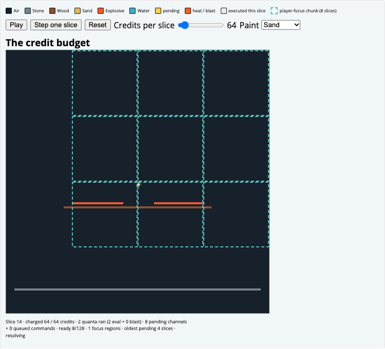
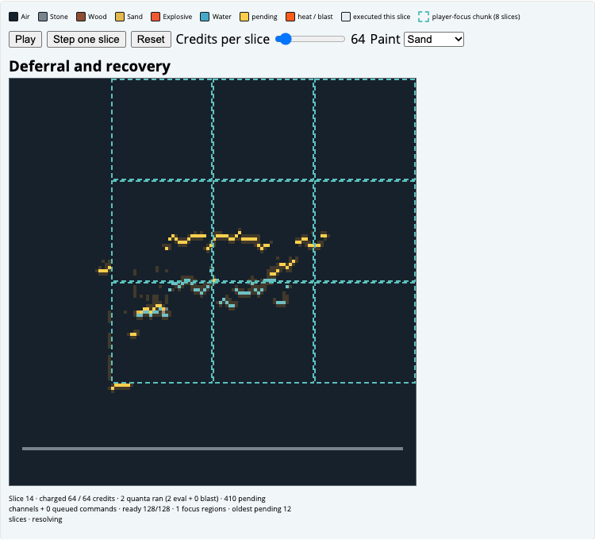
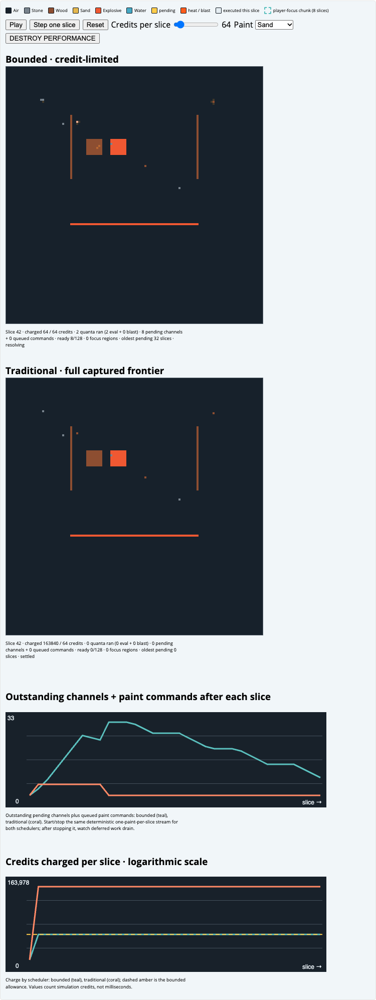
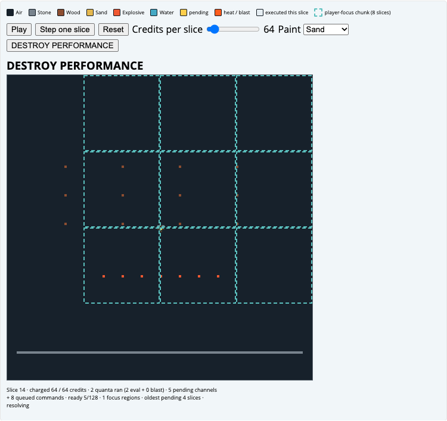
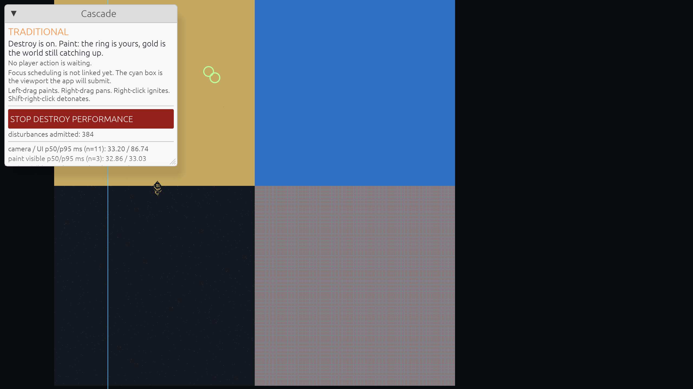
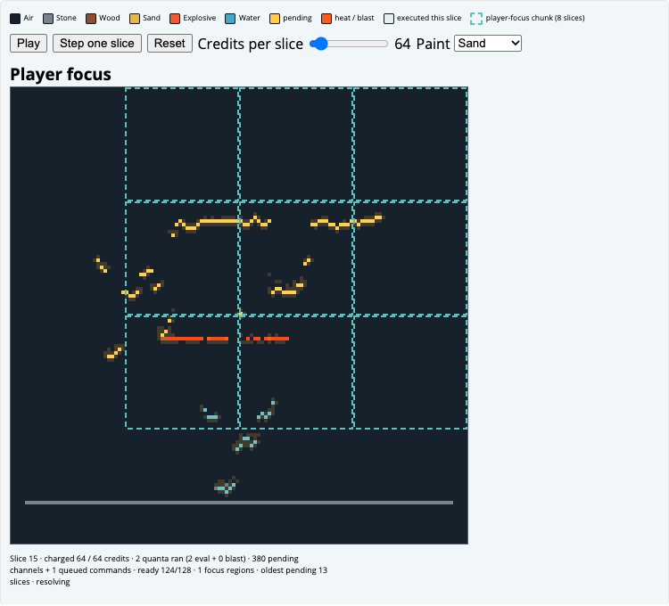

# Interactive feature tour

These small worlds run the repository's actual `cascade-sim` compiled to WebAssembly. Each 128 by 128 world is rendered at 4 screen pixels per cell; the controls and canvases stay horizontally scrollable on narrow screens so cells do not shrink. Material swatches, pending amber, hot orange heat/blast, pale executed-this-slice highlights, and teal dashed outlines for active player-focus chunks are shown in each widget legend. Each canvas is also shown as a checked-in image first, so the explanation remains useful before the browser module starts.

<figure>
  
  <figcaption>Cells and local rules: the status reports credits charged/allowed, quanta run, pending channels plus queued commands, ready slots, and oldest-pending age in slices. Pale cells are the latest slice's bounded execution sample, not a count of every cell that ran.</figcaption>
</figure>

**Palette:** Air `#17212b`, stone `#78838d`, wood `#8d4e31`, sand `#e5b84f`, explosive `#f05832`, water `#45a9c5`. Amber highlights pending channels; orange marks burning heat or pending blast energy; pale highlights the bounded sample executed in the latest slice. Teal outlines mark chunks currently receiving focus priority after an admitted ignition action; they do not claim that every highlighted cell executed.

## Cells and local rules

Sand and water inspect only their local neighborhood when selected for evaluation. Fire is a timer on wood; a blast carries bounded, attenuating energy. Dormant cells do no recurring work, while a mutation wakes nearby cells for reevaluation. This is intentionally asynchronous local simulation, not a globally synchronized physics tick. Click a cell to ignite it; shift-click to paint the selected material.

<figure>
  
  <figcaption>Credit budget: the status line's charged value is the actual simulation-credit cost of this slice; the allowance is the cap, and whole quanta that do not fit remain pending.</figcaption>
</figure>

## The credit budget

Every bounded slice charges scheduler probes and each whole quantum before it runs. Work may stop before the allowance is exhausted if no ready quantum fits; it never spends more than the allowance. Lower the slider to make the difference visible. Step advances exactly one slice, without relying on a frame timer.

<figure>
  
  <figcaption>Deferral: ready is occupied ring slots out of 128; pending is outstanding evaluation/blast channels, including work waiting for ring capacity.</figcaption>
</figure>

## Deferral and recovery

The ready rings have fixed capacity (64 slots per lane in this small tour fixture, intentionally smaller than the native profile). When a ring fills, each affected cell retains its pending bit and a recovery cursor incrementally finds work to admit as slots open. The oldest-pending age reports slices since the oldest outstanding channel was first marked. It is not a prediction of completion time; sustained demand can keep backlog growing.

<figure>
  
  <figcaption>Same seeded wood/explosive grid and deterministic stone/wood disturbance stream. The upper graph counts pending channels plus queued paint commands after each slice; the lower log-scale graph plots credits charged per slice, with the bounded allowance in dashed amber. In this capture the bounded allowance is 64 credits; a traditional full-world scan alone costs 163,840 credits and its loaded slice reaches about 164,000. These are simulation credits, not elapsed time.</figcaption>
</figure>

## Bounded versus traditional

Both worlds use the same seeded, packed wood/explosive scene, real rules, and 64-credit bounded allowance. Traditional mode captures and executes its full pending frontier at slice entry, including a full-world scan, and may charge far more than the bounded allowance. The upper plot adds outstanding pending channels and queued paint commands after each slice; the lower plot is credits actually charged per slice on a logarithmic scale. Use the disturbance toggle to admit the same deterministic one-paint-per-slice stream to both worlds, then stop it and watch the deferred bounded backlog trend back toward its initial level. The per-canvas status gives the exact current slice charge and allowance. These counters describe simulation work, not speed or wall-clock time; use the [performance report](performance.md) for measured benchmark methodology and results.

<figure>
  
  <figcaption>DESTROY PERFORMANCE in a 128 by 128 world: each cell is 4 screen pixels wide. Status quanta count work run; pale cells show the latest slice's bounded sample, while pending/queued and ready counts show remaining work.</figcaption>
</figure>

## DESTROY PERFORMANCE, in miniature

The native app provides the full-scale counterpart:

<figure>
  
  <figcaption>Native app screenshot from the existing overload smoke path; unlike the browser illustrations, the benchmark evidence is reported separately.</figcaption>
</figure>

The button admits a capped stream of repeated cell disturbances into the same fixed world. Releasing it stops new requests; accepted work remains pending. This miniature illustrates overload and recovery without claiming full-size timing or resource results.

<figure>
  
  <figcaption>An admitted ignition focuses the target's neighboring chunk region for eight slices. Teal outlines show active priority regions; pale cell highlights separately mark the bounded sample that executed in the latest slice.</figcaption>
</figure>

## Player focus

An admitted click-to-ignite command activates a bounded priority region around its target for eight simulation slices. This is scheduler focus, not proof that every cell in the outlined region has run. The dashed teal chunk borders show active focus; pale cell highlights show the separate bounded execution sample. Shift-click painting does not create a focus region.

<link rel="stylesheet" href="tour/tour.css">
